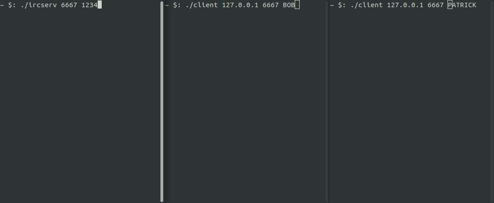
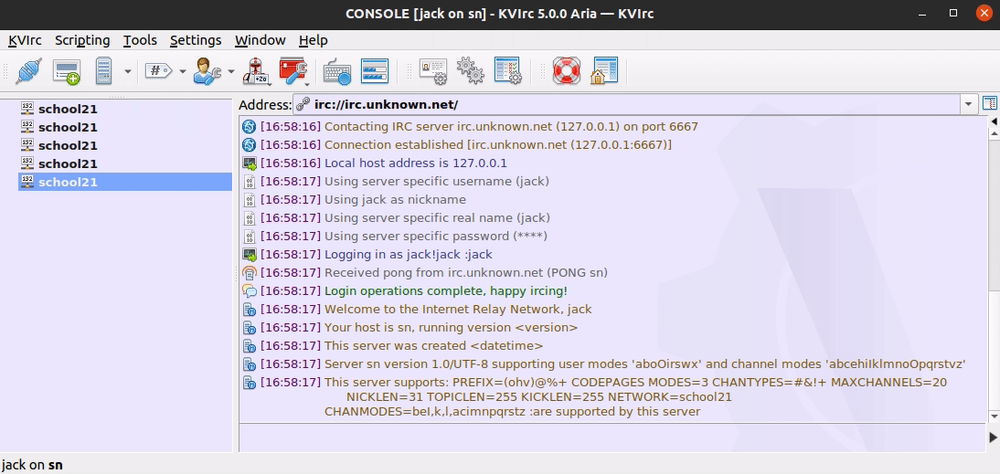

## ft_irc

team project of 42 school where it is necessary to implement own simple IRC server, based on the [RFC 1459](https://datatracker.ietf.org/doc/html/rfc1459) standard. the project was made by [ngamora](https://github.com/zagaynov-andrew), [mteressa](https://github.com/Fkhalilullin) and [constbar](https://github.com/constbar).

Internet Relay Chat is a legacy application layer protocol for real-time messaging. designed for group communication, also allows you to communicate through private messages and share files. on the basis of IRC, many messengers were later developed.

the server does not support server-to-server communication.

### how to use it

**to launch the server:**
```
make
./ircserv <port> <password>
```
example:
```
./ircserv 6667 1234
```
**to launch the client:**
```
cd client && make
./client <ip> <port> <nickname>
```
example:
```
./client 127.0.0.1 6667 jack_sparrow
```


out irc server works through the KVIrc client too.



also there you can run our bot and transfer files between clients. the truth is, now the bot can only send memes in response, but it is possible to make any functionality for it.

### implemented commands

| command | params | description |
|---|---|---|
| PASS | `<password>` | used to set up a 'password connection'. a password must be set before any attempt. |
| NICK | `<nickname>` | used to assign an nickname to the user or change the previous one. there can be no two identical nicknames on the server. |
| USER | `<username>` `<hostname>` `<servername>` `<realname>` | used at the beginning of a connection to specify the username, hostname, server name and real name of the new user. |
| OPER | `<user>` `<password>` | used to take operator rights. parameters are used to identify the user. |
| QUIT | `[<quit message>]` | used to terminate the connection to the server. the server should end the connection with the client when it sees the sent message. |
| PING / PONG | `<server1>` `[<server2>]` | used to check for client activity on the other end of the connection. this message is sent at regular intervals unless other activity is noticed from the connection. if the client does not send PONG in response to PING, the connection is closed. |
| PRIVMSG | `<receiver>{,<receiver>}` `<text to be sent>` | used for private correspondence between users. also exists the ability to send messages to channels. |
| NOTICE | `<nickname>` `<text>` | works the same as PRIVMSG, except that no response is sent in response to a message. |
| JOIN | `<channel>{,<channel>}` `[<key>{,<key>}]` | used by the client to enter the channel. if a password is set, it must be correct. when users enter a channel, they will receive a notification about all users on the channel. if there was no group before, then the group is created. |
| PART | `<channel>{,<channel>}` | used by the user to leave the channels that he will specify in the parameters. |
| LIST | `[<channel>{,<channel>}` `[<server>]]` | used to display a list of channels and their topics. if the channel parameter is used, then only the status of this channel is displayed. |
| INVITE | `<nickname>` `<channel>` | used to invite users to the channel. if the channel is open, then only the channel operator can invite to it. |
| TOPIC | `<channel>` `[<topic>]` | used to edit or view a channel topic. the channel topic will remain the same unless a new topic is set. |
| NAMES | `[<channel>{,<channel>}]` | used by a user can get a list of all users in the channel. |
| KICK | `<channel>` `<user>` `[<comment>]` | used to exclude a user from a channel can only be used by the channel operator. |
| KILL | `<user>` `<message>` | disconnects the user from the server. |
